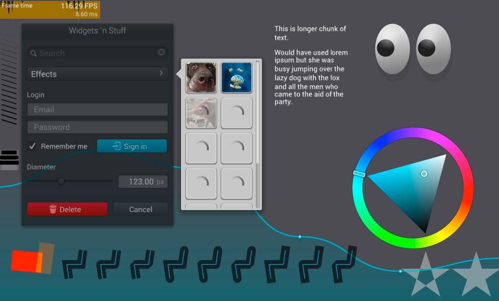
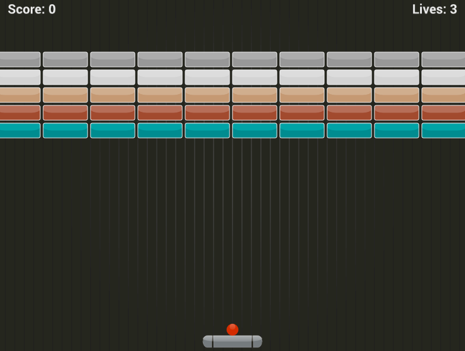
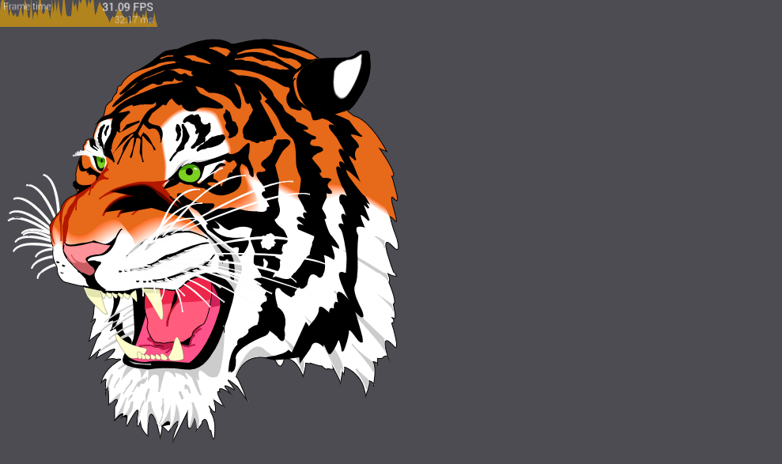
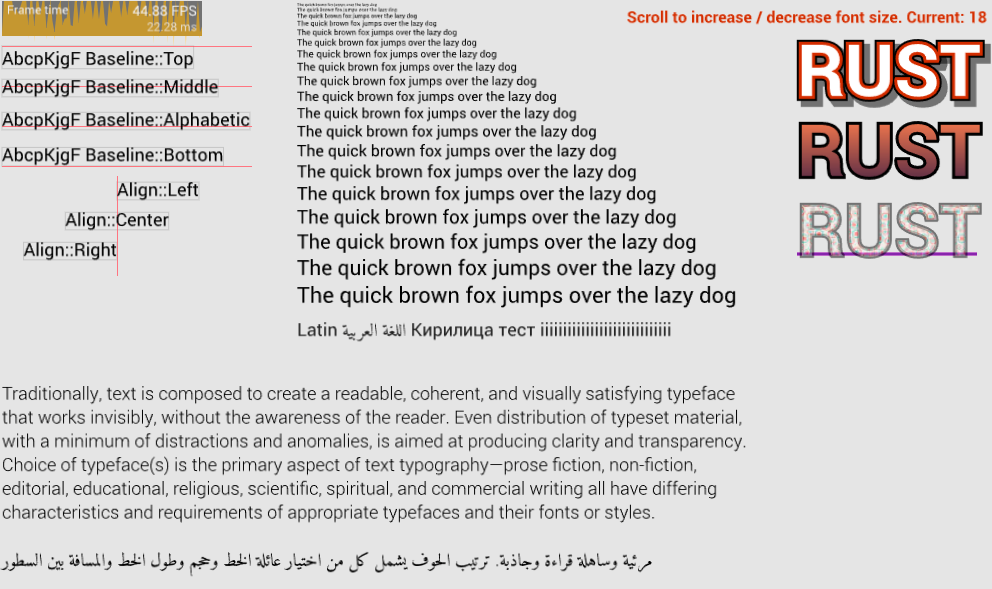

<h2 align="center">femtovg</h2>

GPU Antialiased 2D vector drawing library written in Rust.

- [Cargo crate](https://crates.io/crates/femtovg)
- [Book](https://femtovg.github.io)
- [Join the femtovg Discord channel](https://discord.gg/V69VdVu)

---

Ported from https://github.com/memononen/nanovg

Most of the implementation is the same as the original C code with some bug fixes, some features added and several parts have been made more Rust-y. Rendering is done via one OpenGl (ES) 3.0+ backend.

## Screenshots
### Demo

Run with `cargo run --example demo`

### Breakout

Run with `cargo run --example breakout`

### SVG

Run with `cargo run --example svg`

### Text

Run with `cargo run --example text`

## Features
* [x] Anti-aliasing
* [x] Bézier paths filling and stroking
* [x] Solid color and image pattern fills and strokes
* [x] Gradients - box, linear and radial
* [x] Stroke width and miterlimit
* [x] Stroke caps: butt, round and square
* [x] Stroke joins: miter, round and bevel
* [x] Fill rules - EvenOdd/NonZero
* [x] Rectangle scissoring
* [x] Composition modes (SourceOver, SourceIn, SourceOut, Atop, etc..)
* [x] Global alpha
* [x] Text filling and stroking
* [x] Text shaping
* [x] Text alignment: (left center right), (top, middle, alphabetic, bottom)
* [x] Nearest font matching
* [x] Path hit testing
* [x] OpenGl ES2 backend

## In progress
* [ ] [Metal backend](https://github.com/adamnemecek/gpucanvas/)

## Not supported
* [ ] Stroke dashing
* [ ] Path scissoring
* [ ] Custom shaders
* [ ] 3D transforms
* [ ] Color fonts

## License
Licensed under either of
 * Apache License, Version 2.0 ([LICENSE-APACHE](docs/LICENSE-APACHE) or http://www.apache.org/licenses/LICENSE-2.0)
 * MIT license ([LICENSE-MIT](docs/LICENSE-MIT) or http://opensource.org/licenses/MIT)
at your option.

Fonts used in examples:
- Roboto licensed under [Apache license](http://www.apache.org/licenses/LICENSE-2.0)
- Entypo licensed under CC BY-SA 4.0.
- Amiri licensed under [SIL Open Font License, Version 1.1](http://scripts.sil.org/cms/scripts/page.php?site_id=nrsi&id=OFL)
