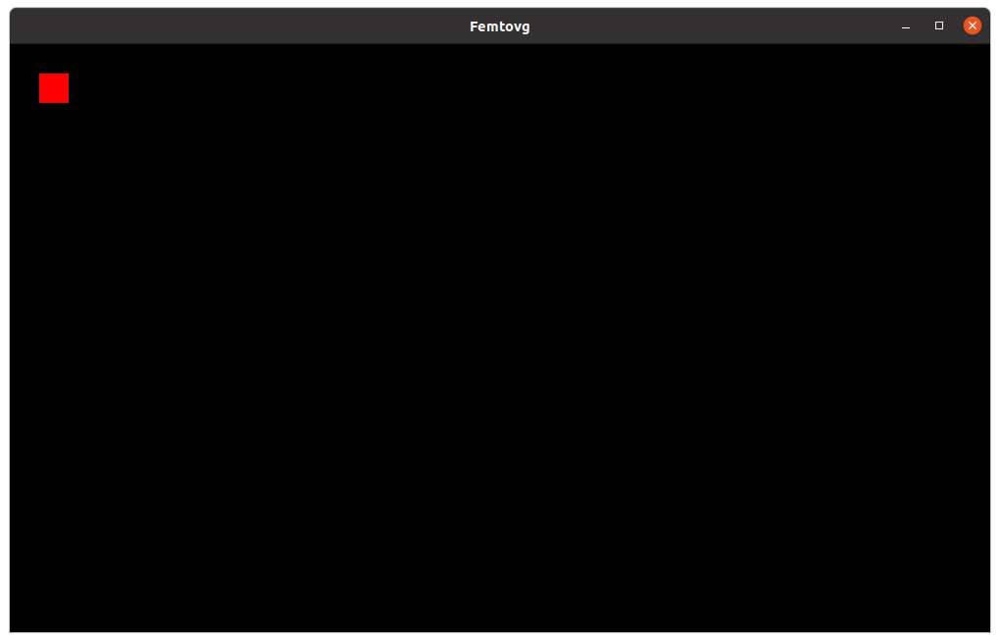

# Rendering

Now that we have a `canvas`, we can start drawing things! To keep things organized, let's create a `render` function that will do all the rendering:

```rust,ignore
fn main() {
    let (context, gl_display, window, surface) = ...;
    // [...]
    let mut canvas = ..;

    render(&context, &surface, &window, &mut canvas);
}

fn render<T: Renderer>(
    context: &PossiblyCurrentContext,
    surface: &Surface<WindowSurface>,
    window: &Window,
    canvas: &mut Canvas<T>,
) {}
```

In `render`, first let's make sure that the canvas has the right size – it should match the dimensions and DPI of the window:

```rust,ignore
let size = window.inner_size();
canvas.set_size(size.width, size.height, window.scale_factor() as f32);
```

Next, let's do some actual drawing. As an example, we'll fill a smol red rectangle:

```rust,ignore
canvas.clear_rect(30, 30, 30, 30, Color::rgbf(1., 0., 0.));
```

> [`clear_rect`](https://docs.rs/femtovg/latest/femtovg/struct.Canvas.html#method.clear_rect) fills a rectangle. The first 2 parameters specify its position, and the next 2 specify the dimensions of the rectangle.
> 
> [`Color::rgbf`](https://docs.rs/femtovg/latest/femtovg/struct.Color.html#method.rgbf) is one of the functions that lets you create a Color. The three parameters correspond to the Red, Green and Blue values in the range 0..1.

Even if you consider your minimalist abstract masterpiece complete, there's actually some more code we need to write. We have to call [`canvas.flush()`](https://docs.rs/femtovg/latest/femtovg/struct.Canvas.html#method.flush) to tell the renderer to execute all drawing commands. Then, we must call [`swap_buffers`](https://docs.rs/glutin/0.30.10/glutin/surface/enum.Surface.html#method.swap_buffers) to display what we've rendered: 

```rust,ignore
canvas.flush();
surface.swap_buffers(context).expect("Could not swap buffers");
```

The `render` function is finished, but if you run your program, you won't get to look at it for very long – as soon as `render` completes, the program exits. To fix this, let's freeze the program with an infinite `loop {}`.

Our program now looks like this:

```rust,ignore
{{#include 2_rendering.rs}}
```

And when we run it, we see the red square we rendered:

