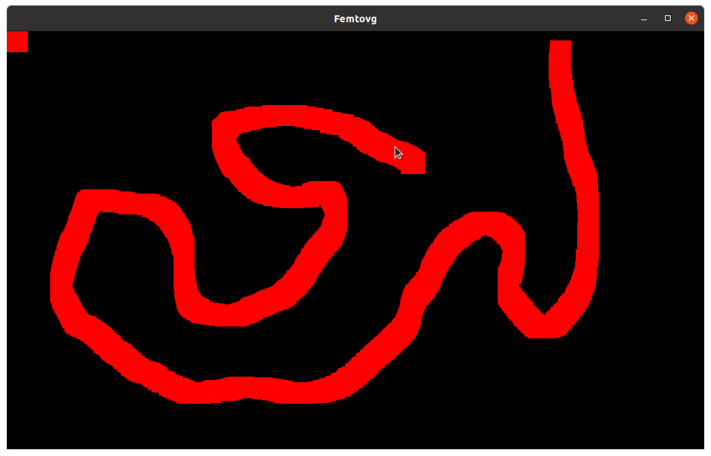
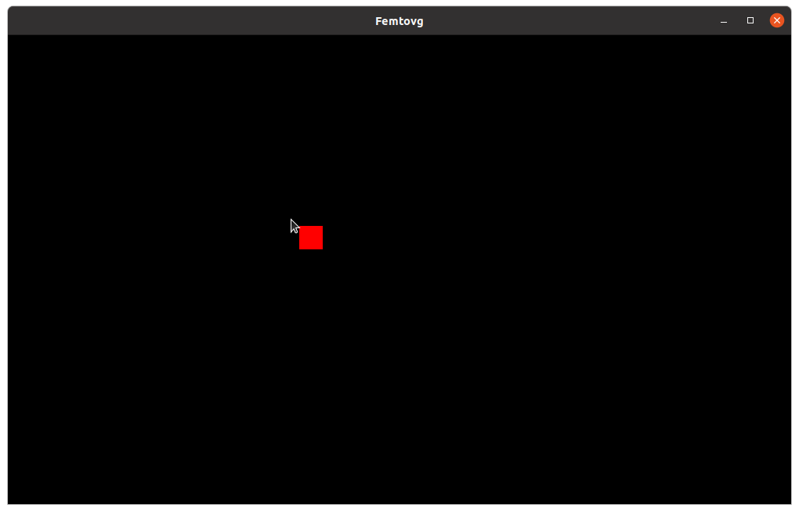

# The Event Loop

So far, our app isn't really "doing" anything – in fact, it won't even respond if we try to close it with the "x" button. To handle input from the user, we must use the event loop.

Let's edit `main` to handle events instead of doing nothing with `loop {}`:

```rust,ignore
fn main() {
    let event_loop = EventLoop::new();
    let (context, gl_display, window, surface) = create_window(&event_loop);

    let renderer = unsafe { OpenGl::new_from_function_cstr(|s| gl_display.get_proc_address(s) as *const _) }
        .expect("Cannot create renderer");

    let mut canvas = Canvas::new(renderer).expect("Cannot create canvas");

    render(&context, &surface, &window, &mut canvas);

    event_loop.run(|event, _target, control_flow| match event {
        Event::WindowEvent { window_id, event } => {
            println!("{:?}", event)
        }
        _ => {}
    })
}
```

[`event_loop.run`](https://docs.rs/winit/0.28.6/winit/event_loop/struct.EventLoop.html#method.run) will call the provided closure for each new event, until the program exits.

[`Event`](https://docs.rs/winit/0.28.6/winit/event/enum.Event.html) is the first parameter of the closure, and the one we are most interested in. It is an enum with a few branches for different types of events. In the example above, we only capture and print `WindowEvent`s, and ignore the rest.

Each `Event::WindowEvent` contains:
- A [`WindowId`](https://docs.rs/winit/0.28.6/winit/window/struct.WindowId.html) – but since we only have 1 window in this example, the ID will always match with our window's ID.
- A [`WindowEvent`](https://docs.rs/winit/0.28.6/winit/event/enum.WindowEvent.html) enum, which contains information about the window event.

> Note: `Event::WindowEvent` is a branch of the `Event` enum, which contains another enum, `WindowEvent`, of the same name! It can get confusing, but Rust namespaces distinguish between the two – one is `glutin::event::Event::WindowEvent` and the other is `glutin::event::WindowEvent`.

You can run the example to see the different types of `WindowEvent`s being printed as you interact with the window! You might see something like:

```
CursorMoved { device_id: DeviceId(X(DeviceId(2))), position: PhysicalPosition { x: 931.1624145507813, y: 270.08074951171875 }, modifiers: (empty) }
AxisMotion { device_id: DeviceId(X(DeviceId(2))), axis: 0, value: 969.1624302163254 }
AxisMotion { device_id: DeviceId(X(DeviceId(2))), axis: 1, value: 372.08075569337234 }
CursorMoved { device_id: DeviceId(X(DeviceId(2))), position: PhysicalPosition { x: 981.8682861328125, y: 257.404296875 }, modifiers: (empty) }
AxisMotion { device_id: DeviceId(X(DeviceId(2))), axis: 0, value: 1019.8683132424485 }
AxisMotion { device_id: DeviceId(X(DeviceId(2))), axis: 1, value: 359.4042849368416 }
CursorLeft { device_id: DeviceId(X(DeviceId(2))) }
KeyboardInput { device_id: DeviceId(X(DeviceId(3))), input: KeyboardInput { scancode: 113, state: Released, virtual_keycode: None, modifiers: (empty) }, is_synthetic: true }
ModifiersChanged((empty))
Focused(false)
```

## Exiting on Close
Clicking on the window's close button also creates a `WindowEvent`. We'll capture this event to exit the application when the user requests it:

```rust,ignore
event_loop.run(move |event, _target, control_flow| match event {
    Event::WindowEvent { event, .. } => match event {
        WindowEvent::CloseRequested => *control_flow = ControlFlow::Exit,
        _ => {}
    },
    _ => {}
})
```

Try running it! Thr program should exit when you click the close button.

> The third parameter of the closure is of type [`ControlFlow`](https://docs.rs/glutin/latest/glutin/event_loop/enum.ControlFlow.html). You can set it to `ControlFlow::Exit` to request the application to quit.

## Tracking Mouse Movement

Using the `CursorMoved` event, we can track the mouse position. Let's create a variable for storing the latest position we know, and updating it whenever we get a `CursorMoved` event:

```rust,ignore
let mut mouse_position = PhysicalPosition::new(0., 0.);

event_loop.run(move |event, _target, control_flow| match event {
    Event::WindowEvent { window_id, event } => match event {
        WindowEvent::CursorMoved { position, .. } => {
            mouse_position = position;
        }
        // ...
    },
    _ => {}
})
```

## Re-rendering
So far, our code only renders the window once – after that, there's no rendering, only event handling. But suppose we wanted the red square to follow the mouse. How can we re-render the square in the new position?

We'll need to re-render every time the mouse position changes. The correct way to do this is to [`request_redraw`](https://docs.rs/glutin/latest/glutin/window/struct.Window.html#method.request_redraw), so that the platform knows we want to draw some new stuff. Then, we'll receive a `Event::RedrawRequested` event, and that's when we can render a new frame:

```rust,ignore
let mut mouse_position = PhysicalPosition::new(0., 0.);
event_loop.run(move |event, _target, control_flow| match event {
    Event::WindowEvent { window_id, event } => match event {
        WindowEvent::CursorMoved { position, .. } => {
            mouse_position = position;
            window.request_redraw();
        }
        // ...
    },
    Event::RedrawRequested(_) => {
        render(&context, &surface, &window, &mut canvas, mouse_position);
    }
    _ => {}
})
```

Finally, we should update our `render` function to take the mouse position into account – we can just use those coordinates for the square position:

```rust, ignore
fn render<T: Renderer>(
    context: &PossiblyCurrentContext,
    surface: &Surface<WindowSurface>,
    window: &Window,
    canvas: &mut Canvas<T>,
    square_position: PhysicalPosition<f64>,
) {
    //...
    canvas.clear_rect(
        square_position.x as u32,
        square_position.y as u32,
        30,
        30,
        Color::rgbf(1., 0., 0.),
    );
    //...
}
```

Our code runs! There's just one small problem...



What happened? Since there's no code to "erase" the old square, all the squares pile up on each other, creating a red mess. To fix this, we should clear the entire window before rendering anything new.

```rust,ignore
canvas.clear_rect(0, 0, size.width, size.height, Color::black());
```

Now, if you run the code, the red square will happily follow the cursor wherever it goes.



To recap, here's the code we've written:

```rust,ignore
{{#include 3_event_loop.rs}}
```