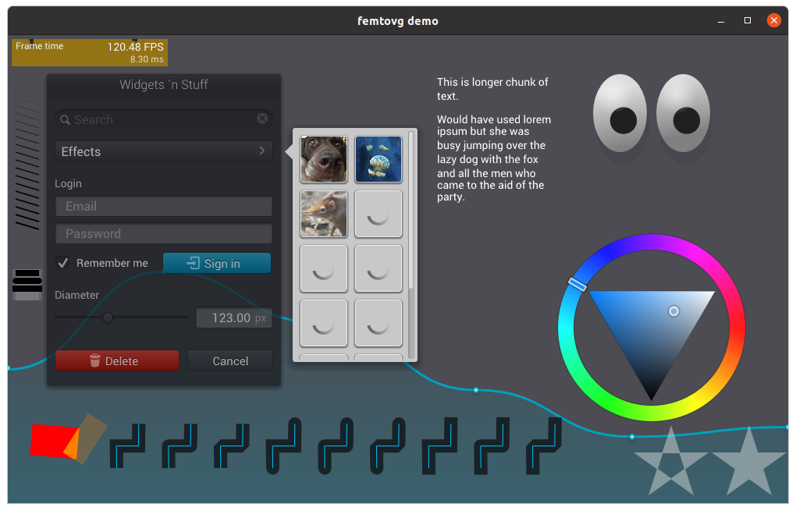

# Introduction to Femtovg

Femtovg is a 2D graphics library written in Rust. This means you can draw shapes and stuff with it!

For a quick demo, clone the repository and run the [demo example](https://github.com/femtovg/femtovg/blob/master/examples/demo.rs) (you'll need to have [Rust installed](https://www.rust-lang.org/learn/get-started)):

```commandline
git clone https://github.com/femtovg/femtovg.git
cd femtovg
cargo run --example demo
```



You can run other examples too. Try `cargo run --example text` or `cargo run --example breakout`!
